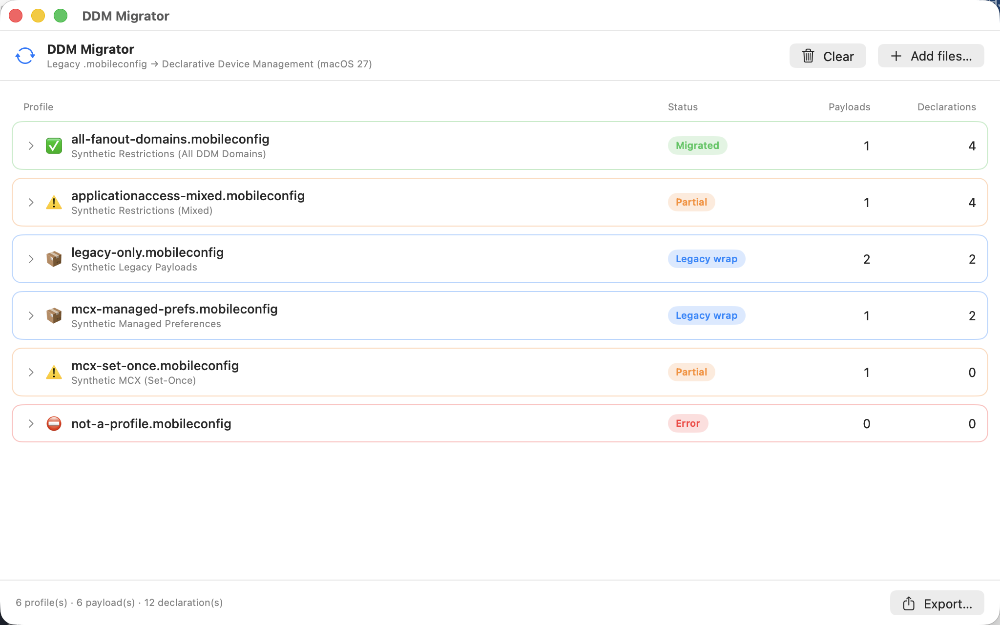
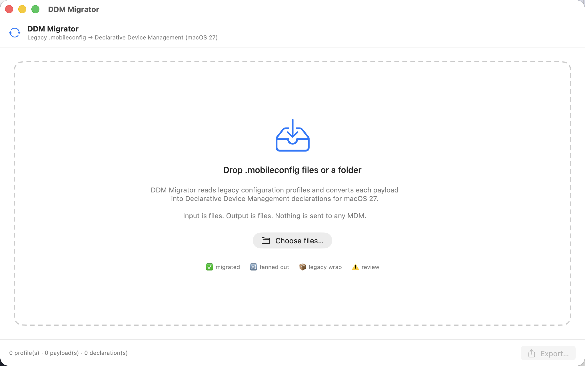
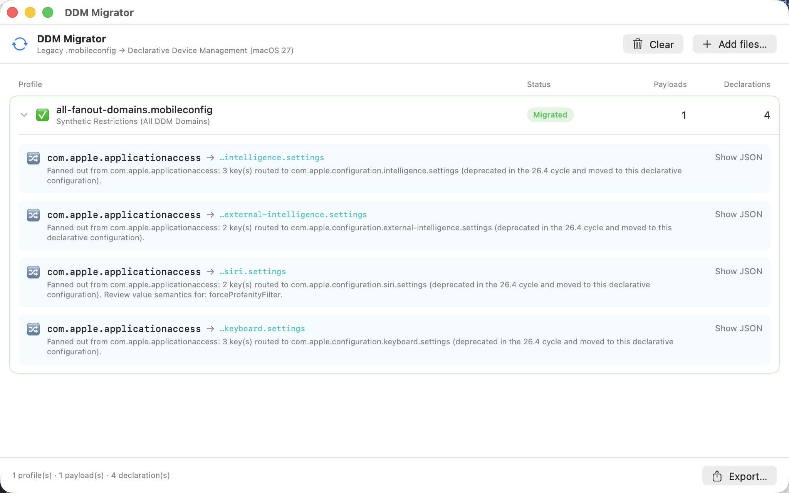
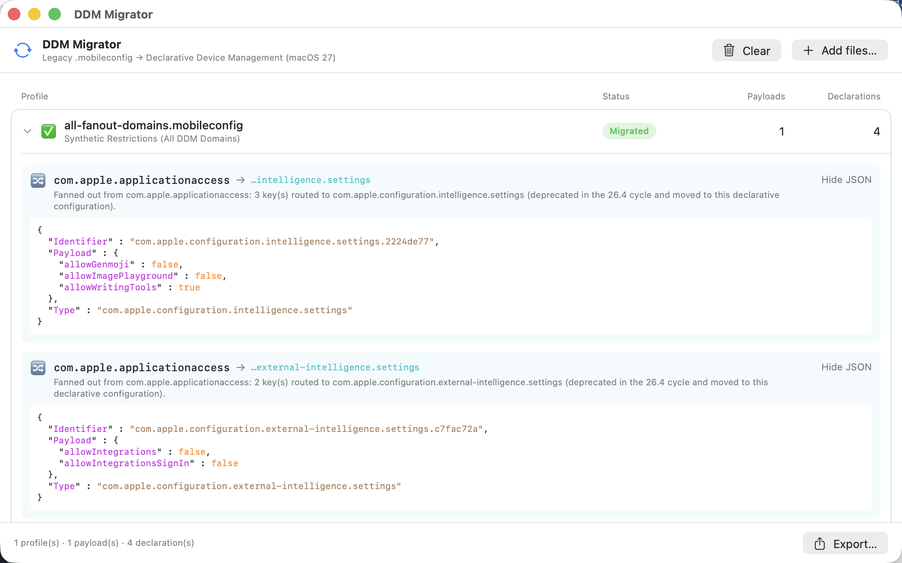

# DDM Migrator

[](https://github.com/mactesting12/ddm-migrator/actions/workflows/ci.yml)
[](LICENSE)
[](#requirements)

**Migrate legacy `.mobileconfig` configuration profiles into Declarative Device Management (DDM) declarations for macOS 27.**

DDM Migrator is a small, native macOS app for Mac admins. Drop in your old MDM
configuration profiles and it converts each payload into the equivalent DDM
`*.ddm.json` declarations — and gives you a migration report that explains, payload
by payload, exactly what it did and why.

> _A [Machinery Software](https://github.com/mactesting12) project._



<details>
<summary><strong>More screenshots</strong></summary>

**Empty state — drop in your profiles**



**One `applicationaccess` payload fanning out to all four DDM domains**



**Expanded detail — per-payload disposition with JSON preview**



</details>

---

## What it does

Drag in one or many `.mobileconfig` files (or a folder) and DDM Migrator:

- **Strips CMS/PKCS7 signatures** — Jamf and others export signed profiles. DDM
  Migrator decodes the envelope natively (Security framework `CMSDecoder`, no
  `openssl` shell-out) and also handles plain unsigned profiles.
- **Walks every payload** through a data-driven mapping table — no `if/else` sprawl.
- **Fans out `com.apple.applicationaccess`** — the centerpiece. In the macOS 26.4
  cycle, Apple Intelligence, Siri, and keyboard restriction keys were deprecated in
  the legacy restrictions payload and moved to dedicated declarative configurations.
  So one restrictions payload **splits** across up to four domains:
  - `com.apple.configuration.intelligence.settings`
  - `com.apple.configuration.external-intelligence.settings`
  - `com.apple.configuration.siri.settings`
  - `com.apple.configuration.keyboard.settings`
- **Unwraps MCX** (`com.apple.ManagedClient.preferences`) — pulls settings out of
  the nested `Forced[0].mcx_preference_settings` structure, per preference domain.
- **Never silently drops anything.** Payloads with no declarative equivalent are
  preserved verbatim and wrapped as `com.apple.configuration.legacy` (referencing
  the profile via the `ProfileAssetReference` mechanism), with the reason recorded.
- **Writes a migration report** (`migration-report.md` + `.json`) classifying every
  payload as migrated / fanned-out / legacy-wrapped, with reasons and flagged edge
  cases. This is the part that gives you confidence.
- **Vendor-neutral output + a deployment guide.** Declarations are standard Apple
  JSON, not tied to any one MDM. Every export includes a `DEPLOYMENT.md` with
  per-MDM steps (FleetDM, Jamf Pro, Kandji/Iru, Addigy, Mosyle, Intune) and a
  `.payload.json` companion for paste-based MDMs.

## Scope boundary (v1)

**Input is files. Output is files.** DDM Migrator reads `.mobileconfig`, transforms
payloads, and writes `*.ddm.json` declarations plus a report.

By default it does **not** touch any MDM — it transforms files and writes files,
and does not verify that declarations land on devices.

The **one** exception is opt-in: the CLI's `--push-fleet` uploads the produced
declarations to FleetDM (the one MDM with a custom-declaration API today). It's
off unless you ask for it, the API token comes only from the `FLEET_API_TOKEN`
environment variable, and the SwiftUI app stays entirely files-only. Everything
else is still "files in, files out" — you take the declarations into your own MDM
workflow (see below).

## Deploying to your MDM (vendor-agnostic)

The output is **standard Apple declaration JSON** (`Type` / `Identifier` /
`Payload`), so it isn't tied to any one MDM. How you get it onto devices depends
on the vendor — and not every MDM lets you import a custom declaration yet. Every
export drops a `DEPLOYMENT.md` with step-by-step instructions; here's the summary:

| MDM | Import custom DDM JSON? | How |
|---|---|---|
| **FleetDM** | ✅ Yes | Upload the `.ddm.json` under **Controls → OS settings**, or commit to Fleet **GitOps** — each export generates a ready-to-merge `fleet-gitops.yml` referencing every declaration. |
| **Jamf Pro** | ✅ Yes (Blueprints) | **Blueprints → Custom Declarations → Add item**: set Kind = Configuration, Channel, **Type**, and **Payload** (use the `.payload.json` companion — Jamf wants the Payload object, not the whole envelope, and generates the Identifier itself). API deploy is "coming soon" per Jamf. |
| **Kandji (now Iru)** | ⚠️ Not directly | DDM is delivered via Kandji/Iru's own Library items; no documented custom-JSON import. Use the files as the audited source of truth. |
| **Addigy** | ⚠️ Not directly | DDM via Addigy policies (today mostly OS updates); no custom-JSON import yet. |
| **Mosyle** | ⚠️ Not directly | DDM via Mosyle's policy UI; no custom-JSON import. |
| **Intune** | ❌ Not yet | Only Microsoft-surfaced declarations (Settings Catalog → DDM, mainly software updates); no arbitrary custom DDM JSON. |

For the ⚠️/❌ vendors the declarations are still valuable: they're the exact,
audited settings to reproduce in that MDM's UI, and they're ready to import the
moment the vendor adds custom-declaration support. Today, **FleetDM and Jamf Pro**
are the two that accept your own declaration JSON directly.

## Requirements

- macOS 14 or later
- Xcode 15+ / Swift 5.9+ (to build)

## Build & run

```sh
git clone https://github.com/mactesting12/ddm-migrator.git
cd ddm-migrator

# Run the app
swift run DDMMigratorApp

# Or build a release binary
swift build -c release
.build/release/DDMMigratorApp
```

Run the engine's unit tests (headless, no UI):

```sh
swift test
```

Build a double-clickable, Dock-visible `.app` (with the generated icon):

```sh
scripts/build-app.sh            # -> build/DDM Migrator.app
open "build/DDM Migrator.app"
```

### Command-line (for CI / scripting)

The same engine ships as a headless `ddm-migrate` CLI:

```sh
swift run ddm-migrate fixtures/ -o out/
# or build a binary: swift build -c release && .build/release/ddm-migrate ...

ddm-migrate <inputs...> -o <output-dir> [options]
  -o, --output <dir>     Output directory (required)
  -q, --quiet            Suppress the per-file summary
      --strict           Exit non-zero if any input fails to parse
      --no-payload-only  Skip .payload.json companions (Jamf paste)
      --no-preserved     Skip .preserved.plist companions (legacy)
      --no-fleet         Skip the fleet-gitops.yml snippet
```

It writes the same declarations, reports, `DEPLOYMENT.md`, and `fleet-gitops.yml`
as the app — handy in a pipeline.

#### Pushing to Fleet (opt-in)

The CLI can upload the produced declarations straight to FleetDM via its
`POST /api/v1/fleet/configuration_profiles` API:

```sh
export FLEET_API_TOKEN=…              # token only from the environment, never a flag
ddm-migrate profiles/ -o out/ \
  --push-fleet --fleet-url https://fleet.example.com --fleet-team 3

# preview first — lists what would upload, makes no calls:
ddm-migrate profiles/ -o out/ --fleet-dry-run --fleet-url https://fleet.example.com
```

Legacy-wrapped declarations are skipped by default (their `ProfileURL` is a
placeholder); add `--fleet-include-legacy` to send them. Newer Fleet builds
renamed `team_id` → `fleet_id`; use `--fleet-team-field fleet_id` if needed.
Jamf push is a planned follow-up once its Blueprints declaration-step API is
confirmed.

## Architecture

The logic and the UI are cleanly separated so the engine can be reused or wrapped
in a CLI later:

| Target | What it is |
|---|---|
| **`DDMCore`** | The engine. Pure Swift, no UI. CMS decode → payload walk → fan-out / MCX / legacy-wrap → declarations + report. Fully unit-tested. |
| **`DDMMigratorApp`** | The SwiftUI app: drop zone, results table, JSON preview, export. |
| **`ddm-migrate`** | Headless CLI over the same engine, for CI and scripting. |

The two interesting tables to read first:

- `Sources/DDMCore/MappingTable.swift` — payload type → handler.
- `Sources/DDMCore/FanOutTable.swift` — the `applicationaccess` key → DDM domain
  routing. This is the single auditable place to adjust as Apple finalizes the
  declarative schemas.

## Provenance / clean-room note

Built clean-room from public Apple Developer documentation. Contains **no
employer-internal code, profile values, tenant identifiers, tokens, or
configuration**. All test fixtures are synthetic.

The DDM configuration domain strings are taken from Apple's public DDM / Platform
Deployment documentation for the macOS 27 cycle. The declarative **key names** in
the fan-out table are a best-effort mapping and the single place to adjust as the
schemas firm up; value **semantics** are passed through unchanged, and anything
that may need re-interpretation is flagged in the report rather than guessed.

## Contributing

Contributions welcome! See [CONTRIBUTING.md](CONTRIBUTING.md). The one hard rule:
**never commit real or non-synthetic profile data.**

## License

[MIT](LICENSE) © 2026 Machinery Software LLC
